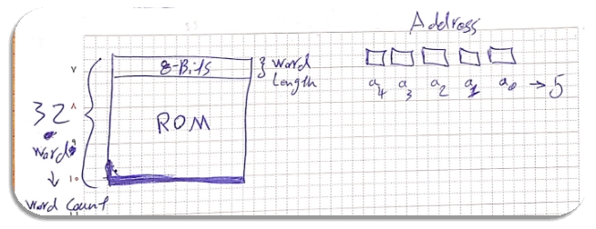
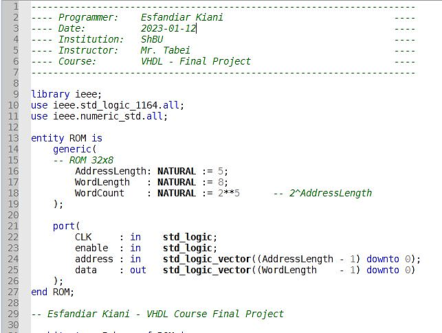


# Project Report

**Behavioral & Structural VHDL**

**Implementation of a ROM** 

BY

[**Mr. Kiani, Esfandiar**](mailto:Es.Kiani@outlook.com)

Student ID: 9957122

Department of Computer Engineering

Sheikhbahaee University

**Supervisor**

Mr. Tabei, Mehdi

**Winter 2023**
1. ## **Abstraction**

This report delves into the design and implementation of Read-Only Memory (ROM) using two distinct design paradigms within the VHDL (VHSIC Hardware Description Language) framework: Behavioral and Structural modeling. The Behavioral model plays a pivotal role in verifying the logic and functionality of the ROM, whereas the Structural model provides detailed insight into the actual hardware configuration, facilitating a seamless transition from a virtual model to a physical realization.

Extensive simulations have been carried out to validate the performance, accuracy, and effectiveness of the ROM designs. The results affirm that both implementations successfully meet the required specifications, each with its inherent strengths and trade-offs in terms of complexity, simulation speed, and resource utilization.

This report aims to provide a comprehensive reference for scholars in the field, offering a clear example of how VHDL can be employed to tackle complex digital design projects from two fundamentally different but complementary perspectives. It is a testament to the versatility and power of VHDL in modeling and simulating digital circuits, pivotal for both educational purposes and the advancement of digital design and integrated circuitry.

1. ## **Introduction**

Read-Only Memory (ROM) is a type of non-volatile storage medium that is utilized widely in electronic systems to permanently store data. ROM retains its contents regardless of the presence or absence of power, making it an essential component for preserving firmware, bootloader code, and system-level functions across reboots and power cycles. Its applications are diverse, ranging from simple device control found in microwaves and washing machines to complex code storage in computers, smartphones, airplanes, and space shuttles required during system boot-up.

The implementation of ROM using VHDL furnishes designers with a powerful tool for capturing complex digital logic in an abstract, yet precise manner. VHDL not only allows for the synthesis of physical hardware but is also an instrumental asset in the testing and verification processes of its simulation capabilities. It supports a range of abstraction levels, from behavioral modeling, which emphasizes functionality, to structural modeling, focusing on the actual physical representation of circuits. For ROM design, this level of abstraction is especially beneficial as it allows designers to validate logic performance before moving to hardware prototypes.

1. ## **Design Methodology**

1. ### Hardware Design

The design methodology initially aimed to develop a single-phase process for creating a representation of a Read-Only Memory (ROM) device with a capacity of 32 words by 8 bits. This means that the internal structure of the memory is comprised of 32 eight-bit words, which can also be understood as 1-byte words. Consequently, for addressing the individual memory cells (words), a 5-bit address line is required.
1. ### Initial Data Specification

Within the domain of ROM design, a defining attribute is the intrinsic restriction against post-manufacturing data modification within the memory cells. ROM is engineered to maintain data in a static state, rendering it immutable during regular operational conditions. The process of data retrieval is inherently passive, involving selective activation of associated word lines coupled with the actuation of sense amplifiers, consequentially resulting in the output of pre-stored data.

This absence of write capability inherently streamlines the automation process in design execution. The initial dataset is generated by using Python programming language, which is renowned for its power and utility in computational tasks. Python facilitates the creation of this dataset through a deterministic random generation process, tailored for integration and applicability within VHDL frameworks.

The methodical approach adopted ensures that the Python-generated data posits a flexible format, enhancing adaptability and ensuring efficacious application throughout the VHDL design trajectory. The culmination of this procedural approach is manifested in the generation of a standardized output file, the specifications of which will be delineated subsequently.

First of all, I need to import ‘random’ library to generate random (semi-random) data. After that, I define some variables such as seed (to give a specific answer every single time that I run the script), the binary alphabet, and the ROM size.

Also define an empty list datatype to store generated data together, before regenerating random data by using the ‘random.choice()’ method and write them into a file which is named ‘randomData.txt’ in the same directory.

The standart output of the script is:

![ref1]And the ‘randomData.txt’ file content is:

1. ## **Implementation**

After defining the architecture and overall structure of memory arrays and the corresponding bit generators (initial data), the process moved to the hardware design phase using VHDL language.

In addition to the standard inputs and outputs, such as the address and data lines, a control input named ‘enable,’ was incorporated. This active-low input, enables the output to transition between logical 0/1 (High and Low) and High-Impedance (Z) states. Similarly, the structural dimensions were designed with relative parameterization and reference-based, allowing for scalability in the overall design.

This flexibility ensures that changes to the memory array size can be implemented with ease, and it is only the initial data that needs to be adjusted according to the redefined size of the memory cells.

The memory is designed to positive-edge triggered, operating with a delay of one clock cycle. This implies a reliable and stable production of the output after any alterations in the input, becoming visible on the following clock edge.

1. ### Behavioral 
In the VHDL code, after the header part, I used the ‘ieee’ library and imported ‘std\_logic\_1164’ and ‘numeric’ module.

After that, I have to define one or more entities that I want to use them. As you can see in the following code, I use generic datatype to define my ROM size in some variables and define 4 specific ports for clock pulse (CLK), enable, address line (ROM input), and the data line (output).

However, the main part of a VHDL program is the architecture section which we should represent the functionality of our circuit to the machine. In this part, I need to define an 8-bit array (vector) for each memory word, and a second array (not vector) to include all memory word arrays inside it (2D array).

Therefore, to do that, I define a new datatype named ‘ROM\_TYPE’, which is actually a 32-cell array of 8-bit vectors. Now I can store the previously generated data in these cells.

At this stage, the only missing part is the output functionality of the ROM, which is based on the CLK pulse and the input address.

We can do it by using a ‘process’ that monitor the CLK and every time it is changed, run their body. I consider a standard logic for my ROM. In every clock rising-edge, if the ‘enable’ input is equal to ‘0’, the output is going to the High-Impedance mode (Z); otherwise, it shows the data stored in the given address on the address lines.

1. ### Structural

After detailing the architecture, the memory array was also implemented structurally. This approach reutilizes the predefined dimensions for memory cells, applying the same initial random-generated data used in the behavioral implementation (refer to page-4) during the structural design.

In the structural method, an in-depth understanding of the internal circuitry of the memory array is essential to establish connections among various components explicitly in the code. Consequently, for the internally designed memory array, the following internal structure was taken into account

When detailing the internal circuitry of a memory array in a structural description, it is first necessary to define the various elements of the circuit as components. Subsequently, the connections between these components and the related input and output ports must be specified. Therefore, with reference to the internal architecture of the memory array, it becomes evident that there is a requirement for two distinct components: the decoder (‘dec’ is stand for ‘decoder’) and some logical ‘OR’ gates (‘Orc’ is stand for ‘OR Component’). These components must be appropriately sized to match the dimensions required by the memory array.

In this design approach for a ROM memory, the decoder selection lines correspond to the memory address lines, and the memory output represents the initial data.

During the manufacturing process, connecting the decoder's output to the memory output occurs for the bits of each word where the value equals 1. (For a clearer understanding, refer to page 10).

In essence, at any given moment, only one of the decoder's output lines will carry a logical '1', indicating a selected word from the memory. Let's assume in this word, the first and last bits have the value '1', and the rest are '0'. We need to connect this particular decoder output line to the corresponding memory output bits '0' and '7' and leave the rest unconnected for the memory output to match the intended word.

To systematically scale and execute this task, it is necessary to know which words in the initial data have '1' in their first-bit position to connect the decoder's output lines to the OR gate in bit position '1' of the memory output. This process is repeated for all the bits until completion. Accordingly, I modified the output functionality of the Python script that was initially written to generate random data. The revised script now systematically processes all words and for each of the eight memory output bits, it compiles a list. This list comprehensively enumerates the words from the memory where the bit value is equal to 1.

As anticipated, the script's output aligned perfectly with the results of manual calculations and, consistent with the initial data, demonstrated complete accuracy. This concurrence signifies that we can now proceed to codify these connections within the VHDL code. Hence, we are well-positioned to structurally design the internal circuitry of the ROM memory with success assured at this juncture.

![ref1]

**To better understand the output produced in this part:**

The output file has 8 lines, each level representing one bit of the memory output (our memory has 8-bit words).

Output: O1O2O3O4O5O6O7O8

The first line represents O1, the second line represents O2, …

And in each line, we see some numbers between 0 and 31. For instance, it means the words number 1 and 2, have ‘1’ value on their O1 bit.

Now, by having this data I can write a structural code for my ROM. I pass the decoder outputs into a conector signal, and connect the relative outputs of RAM to the coresponding bits of the conector signal to generate the correct data when it is turned on.

14

[ref1]: Aspose.Words.163f7e9f-4d66-4659-b096-df71a18744d7.009.png
